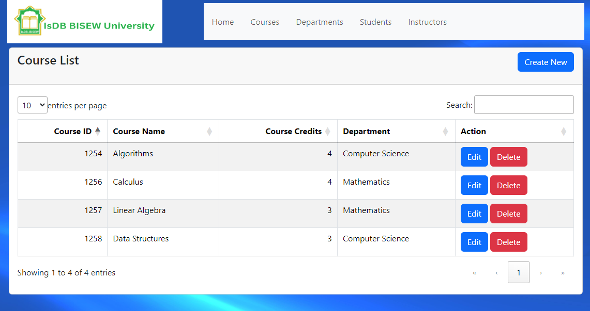
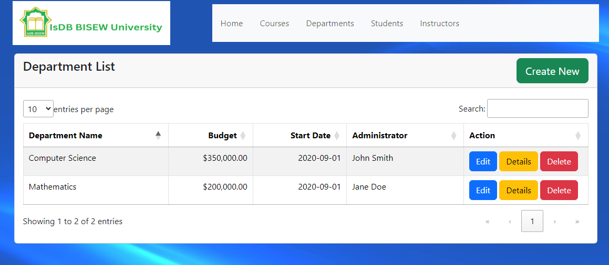
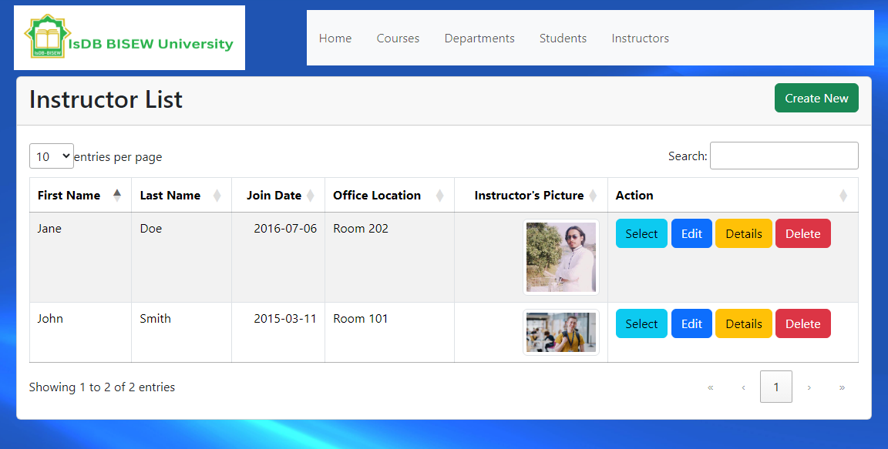
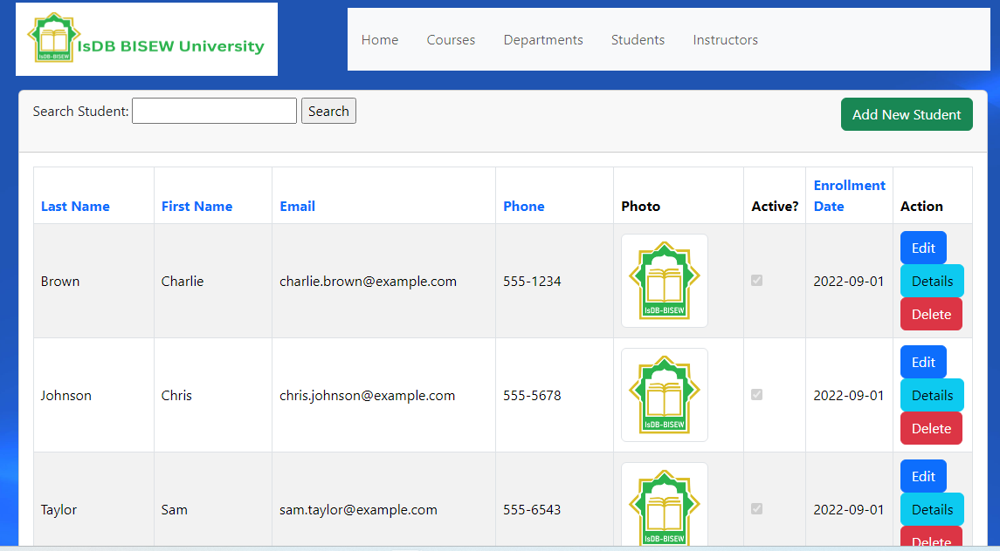

<h2>University Management System</h2>
<h3>Overview</h3>

This University Management System is a robust and user-friendly web application developed using ASP.NET MVC 5 and Entity Framework 6, leveraging the Database First approach. The system provides a seamless interface for managing university-related data, including Courses, Departments, Instructors, and Students. It also incorporates image handling capabilities for user profiles and other relevant records.

<h3>Features</h3>
<ul style="list-style:none;">
  <li><strong>Course Management:</strong> Create, update, delete, and view courses. Assign courses to instructors and manage course details efficiently.</li>
  <li><strong>Department Management:</strong> Manage departments, assign instructors as department heads, and link courses to departments.</li>
  <li><strong>Instructor Management:</strong> Add, update, delete, and view instructor profiles. Assign office locations and courses to instructors, and manage instructor-specific details.</li>
  <li><strong>Student Management:</strong> Enroll students, manage student profiles, and handle student-specific data including images.</li>
  <li><strong>Image Handling:</strong> Upload and manage images for instructors and students to enhance user profiles and other records.</li>
  <li><strong>Sorting and Filtering:</strong> Implement sorting and filtering functionalities across various tables for improved data navigation.</li>
  <li><strong>Validation and Error Handling:</strong> Comprehensive validation and error handling to ensure data integrity and a smooth user experience.</li>
</ul>

<h2>Technologies Used</h2>
<ul style="list-style:none;">
  <li><stromg>ASP.NET MVC 5:</stromg> For creating a scalable and maintainable web application.</li>
  <li><strong>Entity Framework 6:</strong> For data access and management using the Database First approach.</li>
  <li><strong>Bootstrap:</strong> For responsive and modern UI design.</li>
  <li><strong>jQuery and DataTables:</strong> For enhanced user interactions and data handling.</li>
  <li><strong>SQL Server:</strong> As the database solution to store and manage application data.</li>
</ul>

<h2>System Overview in Images</h2>

Below are some screenshots of the system:

 <h3>Home Page</h3>
    
    
    <h3>Course Management</h3>
    
        
 <h3>Department Management</h3>
    
        
  <h3>Instructor Management</h3>
    
    
 <h3>Student Management</h3>
    
   

<h2>Master-Detail CRUD Application</h2>

Using Entity Framework Code First for managing Courses, Departments, Instructors, and Students with image support.

<h3>How to Use This Application</h3>

<ul>
  <li>
    <strong>Initial Setup:</strong>
    <ul>
      <li>Open Microsoft SQL Server Management Studio.</li>
      <li>Copy the server name.</li>
      <li>Navigate to the root folder of the IdbUniversity application.</li>
      <li>Open <code>Web.config</code>.</li>
      <li>Update the data source with your server name (other settings remain unchanged).</li>
    </ul>
  </li>
  
  <li>
    <strong>Database Setup:</strong>
    <ul>
      <li>Open Visual Studio.</li>
      <li>Navigate to <code>Tools</code> -> <code>NuGet Package Manager</code> -> <code>Package Manager Console</code>.</li>
      <li>Run the command:
        <pre><code>update-database</code></pre>
      </li>
      <li>The database will be created, and data will be seeded.</li>
      <li>If <code>update-database</code> does not work, delete the <code>Migrations</code> folder and run the following commands:
        <pre><code>Enable-Migrations
Add-Migration initIsdbUniversityData
Update-Database</code></pre>
      </li>
      <li>If issues persist, ensure the database catalog name in <code>Web.config</code> is correct.</li>
      <li><strong>Note:</strong> The <code>update-database</code> command should work fine Insha Allah.</li>
      <li><strong>***Note:</strong> After updateing database and seed, open sql server management, right click on table CourseInstructor table in edit mode the insert CourseID 1254 and InstructorID 1</li>
    </ul>
  </li>

  <li><strong>Rebuild the project</strong></li>
  <li>
    <strong>Run the Application:</strong>
    <ul>
      <li>Open <code>HomeController</code> and run the project.</li>
    </ul>
  </li>

  <li>
    <strong>Features:</strong>
    <ul>
      <li>Search functionality works by <code>LastName</code> and <code>FirstMidName</code>.</li>
      <li>Data/Row sorting works by <code>LastName</code>, <code>FirstName</code>, and <code>Email</code>.</li>
      <li>Pagination is implemented with 3 rows per table.</li>
    </ul>
  </li>
</ul>

This setup and features ensure a smooth and user-friendly experience for managing university-related data.

<h2>Request: </h2>

If you face any problem you can mail me to : <strong>webservice24.org@gmail.com</strong>

<h2>To hire me as freelancer feel free to contact me</h2>
